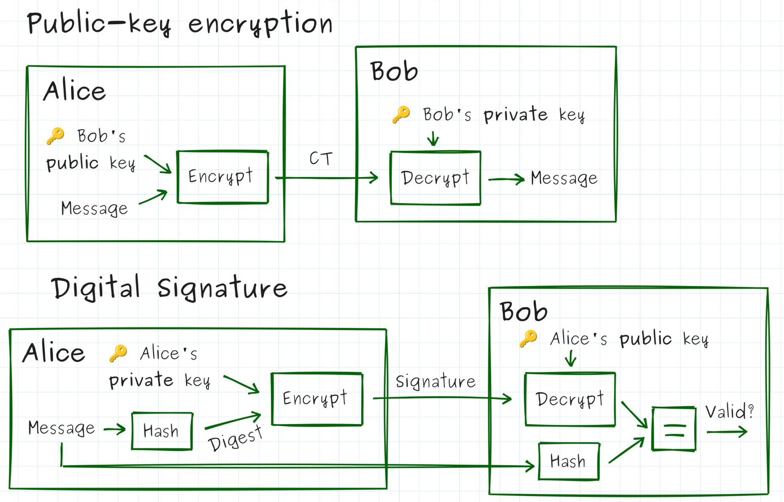

# Worksheet for "Authenticated Exchanges"

Nathan Jones, Mindstorms Engineering, LLC


---

Each exercise has three levels:

- 🔴 **Red** — Observe the running system, trace code, fill in blanks, answer short questions. Everyone should reach this level.
- 🟡 **Yellow** — Apply what you observed, analyze trade-offs, discuss implications. Aim to reach this level.
- 🟢 **Green** — Write new code, extend the system, or evaluate it for flaws. Reach this if you can!

> **How to run the exercises:** All exercises use a synchronous object model — `Badge` and `Reader` are Python objects whose method calls model the messages on the wire. There are no separate reader/badge processes to start in separate terminals. The simplest way to see the full interaction is to run the test suite with `-s` (which lets `print` output appear):
> 
> ```bash
> cd ex1-static-uid
>pytest -v -s
> ```
> You can also paste the short Python snippets shown in each exercise into a REPL or a `demo.py` file in the exercise directory.

---

⚠️ **NOTE:** This workshop teaches authentication concepts using RFID/badge access control as a hands-on example. Everything here — code, diagrams, exercises — is for learning, not for shipping. Use these techniques only on systems you own or have explicit permission to test; don't point them at anyone else's hardware. The protocols we build are teaching tools, not audited designs — if you're building something real, get a security review before it touches production.

---

## Exercise 1: The Static UID

A badge reader has to have *some* way to tell one badge from another. The simplest approach: each badge broadcasts a fixed identifier, and the reader checks it against an allowlist.

### 🔴 Observe the protocol

**Run the demo**

```bash
cd ex1-static-uid
pytest -v -s
```

Or paste this snippet into a REPL:
```python
from pathlib import Path
from badge import Badge
from reader import Reader

reader = Reader(log_path=Path("logs/observed_uids.txt"))
reader.present(Badge(b"A3F29C11"))   # known UID
reader.present(Badge(b"DEADBEEF"))   # unknown UID
```

You should see output like:
```
[READER] Received UID: A3F29C11
[READER] UID found in allowlist.
[DOOR]   *** ACCESS GRANTED ***

[READER] Received UID: DEADBEEF
[READER] UID not in allowlist.
[DOOR]   *** ACCESS DENIED ***
```

---

**Identify the values used for authentication**

Which field does the reader use to decide whether to grant access?

- a) A password the badge sends
- b) The badge's UID
- c) A digital signature computed by the badge
- d) The badge's firmware version

---

**Inspect and evaluate the log file**

After running the demo, open `logs/observed_uids.txt`. What does it contain? What else *could* it contain that might be useful later on?

> <textarea></textarea>

---

**Inspect the reader code**

Open `reader.py`. Find the following without running anything:

- Which line decides access is granted or denied? ___
- Which line writes to the log file, and does it run *before* or *after* the access decision? ___
- Why might the answer to the last question matter? ___

---

### 🟡 Analyze the threat model

**Define key terms**

In terms a smart high schooler could understand, define: **confidentiality**, **integrity**, **authentication**, **availability**, and **non-repudiation**.

> <textarea></textarea>

---

**Analyze a new scenario**

After the demo runs, `logs/observed_uids.txt` contains the UID of every badge presented. An attacker who reads that file and nothing else can construct a badge that gains access.

In your own words: what information is the reader using to make its decision, and what information is it *not* using? Does the attacker need the physical badge?

> <textarea></textarea>

Now consider: does the existence of the log file make the system more or less secure? Are there conditions under which the log is a liability?

> <textarea></textarea>

---

**Estimate a brute-force attack**

A UID in this system is 8 hex digits (e.g. `A3F29C11`). Each hex digit encodes 4 bits.

- How many distinct UIDs are possible? Express as a power of 2, then as a decimal.
- If a reader responds in 100 ms per attempt, how long (in years) would a full brute-force scan take?
- Does that time estimate make the system secure? What real-world constraints could make a brute force attack difficult even if the math looks feasible (e.g. if UIDs were only 4 hex digits)?
> <textarea></textarea>

---

### 🟢 Extend or evaluate

**Compare future scenarios**

For each attacker scenario below, state whether access is granted and then, if it is, brainstorm how the system could possibly still guarantee authenticity under that condition (in other words, how we could still authenticate a badge if the attack is a part of our threat model; we'll discuss defenses for several of these attacks today). The first row has been filled in for you as an example.

| Scenario | Access granted? | What could close this gap? |
|---|---|---|
| Attacker steals the physical badge | Yes | • Requiring an additional pin, fingerprint scan, checking a photograph on the badge, etc<br />• Reissuing badges on a daily basis<br />• Adding location-specific access controls |
| Attacker observes one scan and records the UID | | |
| Attacker knows the allowlist but has no UID | | |
| Attacker guesses the UID randomly | | |

What does this table reveal about the security model of UID-only authentication?
> <textarea></textarea>

What assumptions/restrictions/security protocols would need to be in place to justify this as our production-grade authentication model? (This is the question you should ask yourself at the end of *every* exercise in this workshop — the answer changes each time.)

> <textarea></textarea>

---

**Evaluate the log as an attack surface**

Add a test to `test_ex1.py` that reads `logs/observed_uids.txt`, picks the first UID who's access was `GRANTED`, and uses it to construct a `Badge` that gains access. You may find it useful to familiarize yourself with the `_parse_log` helper function in `test_ex1.py` and how the other tests use it to get data from their respective log files. Run the test to verify that it works.

Then consider: what access controls would you put on that log file in production? Is it sufficient to restrict read access to the log, or does the fundamental protocol need to change? Explain.

Now a different angle: what if `_log()` wrote a hashed or encrypted value instead of the raw UID? What would you gain by doing that, and what would you lose?

> <textarea></textarea>

---

## Exercise 2: Challenge-Response Authentication

Knowing a UID isn't the same as *being* a badge. We need the badge to prove it holds a secret key — without ever transmitting that key. A challenge-response does exactly that: the reader sends an unpredictable value (the *nonce*), and the badge returns an HMAC of that nonce computed with its key.

### 🔴 Observe the protocol

**Run the demo**

```bash
cd ../ex2-challenge-response
pytest -v -s
```

Or paste this snippet:
```python
from pathlib import Path
from badge import Badge
from reader import Reader
import os

KEY = os.urandom(16)
UID = b"A3F29C11"

reader = Reader(
    key=KEY,
    allowlist=[UID],
    log_path=Path("logs/last_session.txt")
)
reader.present(Badge(UID, KEY))
reader.present(Badge(UID, b"wrong_key"))
```

You should see an exchange like:
```
[READER] Received UID: A3F29C11
[READER] Sending challenge: 13E9514839B6F8D9
[BADGE]   Received challenge: 13E9514839B6F8D9
[BADGE]   Sending response:   cdbdc4a787de7a53...
[READER] Response verified.
[DOOR]   *** ACCESS GRANTED ***
[READER] Received UID: A3F29C11
[READER] Sending challenge: E6CF2ADC2135623E
[BADGE]   Received challenge: E6CF2ADC2135623E
[BADGE]   Sending response:   327c24d7d42afd61...
[READER] Response incorrect.
[DOOR]   *** ACCESS DENIED ***
```

---

**Map the code to the diagram**

Here is the challenge-response exchange as a sequence diagram:


Open `reader.py` and `badge.py`. For each arrow, write the line number(s) that send or compute it:

| Diagram arrow | File : line(s) |
|---|---|
| `UID` (badge → door) | |
| `Nonce` (door → badge) | |
| `HMAC(key, nonce)` (badge → door) | |
| *(not on the diagram)* the line that checks the response | |

---

**Describe the new API**

Five new parts of three new libraries (`os, hmac, hashlib`) were introduced in this example. Describe each one; if it's a function, be sure to describe its parameters and proper usage. The first row has been filled in for you as an example.

| Value            | What is it?                      | Description                                                  |
| ---------------- | -------------------------------- | ------------------------------------------------------------ |
| `hmac.new`       | Constructor for an `hmac` object | • Function signature is `hmac.new(key, msg=None, digestmod)`<br />• Computes the HMAC of `key` and `msg` (if present; otherwise call `HMAC.update(msg)` later on when `msg` is known) using the hash algorithm given by `digestmod` |
| `hashlib.sha256` |                                  |                                                              |
| `hexdigest`      |                                  |                                                              |
| `compare_digest` |                                  |                                                              |
| `urandom`        |                                  |                                                              |

Without instantiating `Badge` or `Reader`, open a REPL and, using only the `hmac` and `hashlib`
modules, compute and verify a challenge-response exchange by hand:

1. Compute `mac = hmac.new(key, nonce.encode(), hashlib.sha256).hexdigest()` for a key and nonce of your choosing.
2. Verify it two ways: `mac == expected` and `hmac.compare_digest(mac, expected)`.
3. Show that changing one character of `nonce` before recomputing produces a completely different `mac`.

The point: you should be comfortable calling `hmac.new(...)` directly, not just through `Badge`/`Reader` —
you'll need this fluency for Exercise 4.

---

### 🟡 Analyze the mechanism

**Identify system requirements**

Which of the following (if any) are required for this system to work? Rewrite any option that isn't required in a way that describes a real requirement (or is at least true of the system). The first row has been filled in for you as an example.

| Statement                                                    | "Requirement" (or restated as a requirement/truth)           |
| ------------------------------------------------------------ | ------------------------------------------------------------ |
| UIDs must be less than 16 bytes long.                        | Not a requirement; there is no upper- or lower-limit to UID lengths except that imposed by other system requirements (e.g. lower limit possibly imposed by minimum number of badges in use; upper limit possibly based on memory or processing limitations on the badge/reader) |
| Nonces must be non-repeating.                                |                                                              |
| Responses must be computed using the HMAC algorithm.         |                                                              |
| The algorithm computing the MAC must be resistant to forgery. |                                                              |
| Responses must come back within 100 ms of the reader issuing a nonce. |                                                              |
| Badges must never issue the same response twice.             |                                                              |

What requirements are missing from this list?

> <textarea></textarea>

---

**Evaluate security guarantees**

We've replaced "knowing a UID" with "knowing a shared secret key." What makes the second one more secure than the first? What guarantees do we have under this new system related to authenticity?

> <textarea></textarea>

---

**Justify MAC security properties**

Why does it matter that the responses appear random to an attacker (in other words, having no mathematical relationship to the nonces)?

> <textarea></textarea>

---

**Compute nonce size trade-offs**

The nonce is generated as `os.urandom(8).hex().upper()` — 8 random bytes, i.e. `N = 2^64` possible values.

The birthday-collision approximation (which you'll need to answer the questions below) for "at least one repeat among `x` draws from `N` possibilities" is: $$P(x) \approx 1 - e^{-x^2 / 2N}$$.

- Using the approximation above, what is the probability of a nonce collision after 1,000,000 sessions?
- Now redo the calculation as if the nonce were reduced to 4 bytes (`N = 2^32`) — same 1,000,000 sessions.
- Is nonce reuse catastrophic in *this* protocol? Why or why not? What *would* happen if a nonce were reused?
- Given a target collision probability (say, under 1 in a billion) and an estimate of how many sessions this reader will ever perform in its lifetime, how would you compute the minimum safe nonce length?
- Assume an attacker can possibly have 10 minutes of unfettered access to a reader once a day. How many sessions can that attacker conduct in that time frame (make any necessary assumptions) and over the course of the reader's lifetime? What would be the new minimum safe nonce length?
- What security protocols could you add to this system to prevent brute-force attacks like the ones listed above?
> <textarea></textarea>

---

**(In)Validate your assumptions**

What assumptions or physical/operational security protocols would need to hold for this challenge-response scheme (a single shared key per badge, held on the reader in plaintext) to be considered a valid production defense? Name at least two, and for each one, name a feasible attack that would break it if the assumption turned out to be false.

> <textarea></textarea>

---

### 🟢 Implement or extend

**Write a test for "replay" attacks**

One benefit of this style of authentication (challenge-response or rolling code) that they can defend against "replay attacks", in which an attacker simply records and retransmits an old conversation in an attempt to gain access to the door.

`test_ex2.py` contains `test_replay_attack_denied`. The `ReplayBadge` class allows you to create a special type of badge that returns whatever captured response it was constructed with, regardless of the nonce it receives.

- Finish the implementation of this test to prove that our system can defend against replay attacks. You can simulate "recording" a previous conversation by reading from the log file.
- How could an attacker conduct this attack in real life?
- What's another test you could implement, either to test the functionality *or* the security of this design?

---

**Implement a rolling code (i.e. HOTP)**

Real HOTP tokens don't wait for a challenge from the reader at all — the *badge* keeps its own counter and computes a response the reader can predict, so the badge can even work disconnected (think: a keyfob showing a rotating 6-digit code with no reader in sight).

Redesign (in pseudocode, or actual code if you have time) so that:
- `Badge` stores its own `self._counter`, incremented every time it's asked to respond.
- `Badge.respond()` no longer takes a `nonce` argument — it computes `HMAC(key, str(self._counter))` on its own.
- `Reader` independently tracks the counter it *expects* next, and accepts a response if it matches
  within some small forward window (e.g. the next 5 counter values), to tolerate a badge being
  pressed accidentally while out of range.

Questions:
- What replay property does this preserve that the random nonce also provided?
- What new property does it add (think: can the reader tell if a request was skipped, e.g. button pressed while out of range)?
- What new problem does it introduce that the random-nonce version never had (think: what happens when the badge's counter and the reader's expected counter drift apart — how would you resynchronize)?
- Compare this "rolling code + MAC" design against the nonce-based challenge-response you just built: which one requires the reader to initiate contact, and which one lets the badge work with no reader present at all?

> <textarea></textarea>

---

## Exercise 3: One Key Per Badge

So far every badge shares the same key. If one badge is stolen and its key is extracted, every badge in the building is compromised. The fix: give each badge its own key, derived from a fleet secret and the badge's UID.

### 🔴 Compute derived key and Observe key derivation

**Predict, then verify**
Look at `derive_key.py`. Before running anything: will `derive_key(FLEET, b"A3F29C11")` and
`derive_key(FLEET, b"A3F29C12")` produce the same output, or different output (notice the one digit difference)? Explain your answer then test it in a REPL. If your answer was incorrect, hypothesize why.

```python
from derive_key import derive_key
import os

FLEET = os.urandom(16)

derive_key(FLEET, b"A3F29C11")
derive_key(FLEET, b"A3F29C12")
```

> <textarea></textarea>

---

**Complete the demo**

Complete these two lines of code from `reader.py` in order to correctly determine the derived key and use it to check the MAC value sent by the badge:

```python
badge_key = # derive_key( ??? )
expected = # hmac.new(badge_key, ??? )
```

Then run the tests:

```bash
cd ../ex3-key-derivation
pytest -v -s
```

Or paste this snippet (**Note**: The example below uses a fixed nonce to illustrate that different keys provide different responses to the same nonce, as per the design. We would NEVER use a fixed nonce in practice.):
```python
from derive_key import derive_key
from badge import Badge

FLEET = os.random(16)
NONCE  = b"AABBCCDDEE112233"

for uid in [b"A3F29C11", b"B7E10422"]:
    key  = derive_key(FLEET, uid)
    badge = Badge(uid, key)
    print(f"UID {uid.decode()} key: {key.hex()[:16]}...")
    print(f"  response: {badge.respond(NONCE.decode())[:16]}...")
```

---

**Draw the flowchart**
Sketch a flowchart of `Reader.present()` in `reader.py` — box for each step, diamond for each
decision (there are two decision points). Label where the revoked-check and the MAC-check each sit.

---

### 🟡 Analyze blast radius and trade-offs

**Compare key management implications for three authentication strategies**

Rank order the three examples we've seen so far with respect to each of the categories listed below.

| Category                                                     | UID (Ex1) | `HMAC(fleet_key, nonce)` (Ex2) | `HMAC(device_key, nonce)` (Ex3) |
| ------------------------------------------------------------ | --------- | ------------------------------ | ------------------------------- |
| Difficulty to generate new UIDs/keys                         |           |                                |                                 |
| Difficulty to maintain a database of UIDs/keys               |           |                                |                                 |
| Security risk to maintain a database of UIDs/keys            |           |                                |                                 |
| Risk due to exposing "key" material during the unlock process |           |                                |                                 |
| Difficulty to reprovision a badge with a new UID/key         |           |                                |                                 |
| Difficulty to reprovision a reader with a new allowlist/fleet key |           |                                |                                 |
| Memory requirements for storing key material                 |           |                                |                                 |
| Processing time to check a badge's authenticity              |           |                                |                                 |
| Difficulty to revoke a badge's access                        |           |                                |                                 |
| Impact on other badges when one badge's key is exposed or revoked |           |                                |                                 |

What are the relative advantages and disadvantages of these security systems in this specific regard?

> <textarea></textarea>

---

**Revocation analysis**
A badge can be added to the reader's `revoked` set. Suppose badge `A3F29C11` is stolen and revoked.

Read `reader.py` and answer from the code directly:
- First, why does this example need a revocation process, when that wasn't needed in the first two examples?
- At what line is revocation checked, and is it before or after key derivation?
- Is there a good reason to check revocation *before* deriving the key,
  beyond saving one HMAC computation? (Think about what information the reader computes or reveals
  about a badge *before* it knows whether that badge is even still trusted.)

> <textarea></textarea>

---

**Evaluate a new assumption**
Every earlier exercise assumed the reader itself was physically secure, but Exercise 3 is the first time that assumption actually *matters* — the reader now holds a single secret whose compromise affects every badge in the fleet, not just one.

What specifically changed between Exercise 2 and Exercise 3 that makes "the reader is physically secure" a load-bearing assumption now, when it barely mattered before? What's a feasible attack against a reader that would have been low-value in Exercise 2 but is now extremely high-value?
> <textarea></textarea>

---

### 🟢 Implement or extend

**Design a fleet key rotation**
Suppose the fleet key is compromised. The company needs to re-key all 500 existing badges.

- What new information must be written to each badge?
- Over what channel is that information delivered?
- Can this be done remotely (e.g. over NFC on next tap) or does it require physical access?
- What are the risks during the transition window when both old and new fleet keys are valid?
- In pseudocode or plain English, describe your proposed rotation procedure.
> <textarea></textarea>

---

**Compare "blast radius" for three authentication strategies**

*Quick definition if we haven't covered public-key crypto yet: in public-key (asymmetric) cryptography, each device holds a mathematically linked key pair — a private key it never reveals, and a public key anyone can know (see the diagram below). For now, treat "public-key crypto" as shorthand for "a per-device secret whose leak doesn't expose any other device's secret." We'll use this for real in Exercise 4 (except to verify a reader, not a badge, as described below).*



Consider three approaches a building could take:

| Strategy | How reader gets badge key | What leaks if reader hardware is stolen |
|---|---|---|
| Pre-shared per-badge keys (table) | Stored in reader's table | |
| Derived keys (this exercise) | Computed from FLEET + UID | |
| Public-key cryptography | Badge holds a private key; reader verifies a badge's digital signature | |

Fill in the rightmost column for each row. Which strategy has the smallest blast radius per-reader compromise?

---

## Exercise 4: Mutual Authentication

So far only the badge proves itself to the reader. But what about a *fake reader* — a device that mimics a legitimate terminal to harvest badge credentials? Mutual authentication means both sides prove themselves before either trusts the other.

### 🔴 Complete the two-phase handshake

**Draw the flowchart**

`session.py`'s `run()` method has exactly two decision points. Sketch it as a flowchart — one diamond per decision, one box per phase — and label which `return` statement corresponds to each exit.

---

**Mapping the sequence diagram to function stubs**

Before writing any code, connect the diagram to the files you're about to edit. Here's the
mutual-authentication exchange:


For each arrow or note above in "light coral", which of the six function stubs below implements it? Fill in the blanks before you implement anything:

```python
# From reader.py
def phase1_challenge(self) -> str:
    # implements: _______
    raise NotImplementedError

def phase1_verify(self, uid: bytes, nonce_r: str, response_c: str) -> bool:
    # implements: _______
    raise NotImplementedError

def phase2_respond(self, nonce_c: str) -> bytes:
    # implements: _______
    raise NotImplementedError

# From badge.py
def phase1_respond(self, nonce_r: str) -> str:
    # implements: _______
    raise NotImplementedError

def phase2_challenge(self) -> str:
    # implements: _______
    raise NotImplementedError

def phase2_verify(self, signature: bytes) -> bool:
    # implements: _______
    raise NotImplementedError
```

---

**Describe the API**

You'll need to use five new parts of one new library (`cryptography` — specifically `Ed25519PrivateKey` and the `InvalidSignature` exception) to complete this exercise, which are demonstrated below. Run this code in a REPL to observe that it works.

```python
from cryptography.hazmat.primitives.asymmetric.ed25519 import Ed25519PrivateKey
from cryptography.exceptions import InvalidSignature

private = Ed25519PrivateKey.generate()
print(f"Private key is: {private.private_bytes_raw().hex(' ')}")

public  = private.public_key()
print(f"Public key is: {public.public_bytes_raw().hex(' ')}")

msg = input("Enter a message to be digitally signed or 'q' to quit: ")
while msg != "q":
    signature = private.sign(msg.encode())
    print(f"Signature is: {signature.hex(' ')}")
    
    try:
        verified = public.verify(signature, msg.encode())
        print("Signature can be verified using 'msg' and public key")
    except InvalidSignature:
        print("Failed to verify")
    
    msg = input("Enter a message to be digitally signed or 'q' to quit: ")
```

Now describe each new feature; if it's a function, be sure to describe its parameters and proper usage. The first row has been filled in for you as an example.

| Value        | What is it?                                                  | Description                                                  |
| ------------ | ------------------------------------------------------------ | ------------------------------------------------------------ |
| `generate`   | Constructor for the private key in a public/private key pair | • Function signature is `Ed25519PrivateKey.generate()` (no parameters) |
| `public_key` |                                                              |                                                              |
| `sign`       |                                                              |                                                              |
| `verify`     |                                                              |                                                              |
| `InvalidSignature` |                                                        |                                                              |

---

**Implement mutual authentication**

Now implement the six functions above that correlated with the sequence diagram. Then run the tests to confirm that your code successfully conducts mutual authentication:

```bash
cd ../ex4-mutual-auth
pytest -v -s
```

Or paste this snippet:
```python
from cryptography.hazmat.primitives.asymmetric.ed25519 import Ed25519PrivateKey
from derive_key import derive_key
from badge import Badge
from reader import Reader
from rogue_reader import RogueReader
from session import Session

FLEET     = os.urandom(16)
uid       = b"A3F29C11"
badge_key = derive_key(FLEET, uid)

READER_PRIVATE_KEY = Ed25519PrivateKey.generate()
READER_PUBLIC_KEY  = READER_PRIVATE_KEY.public_key()

# Legitimate reader
badge     = Badge(uid, badge_key, READER_PUBLIC_KEY)
Session(Reader(FLEET, READER_PRIVATE_KEY), badge).run()

# Rogue reader
Session(RogueReader(), badge).run()
```

---

### 🟡 Analyze what mutual auth does and doesn't prevent

**Why not just reuse Exercise 2 in reverse?**

Exercise 2 authenticated the badge to the reader with `HMAC(badge_key, nonce)`. Could the *badge* authenticate the *reader* the same way — the badge sends the reader a nonce, and the reader returns `HMAC(reader_key, nonce)`?

Consider scenarios in which there is a single `reader_key` that goes in all the badges or a `reader_key` which is derived from a second `fleet_key` and a reader UID, convince yourself that any such system would be susceptible to attacks that we've already discussed and prevented in earlier exercises (meaning, this isn't a viable solution under our current threat model). Summarize your analysis below.

> <textarea></textarea>

---

**What does a signature prove that a MAC doesn't?**

You just implemented `phase2_respond` with `self._private_key.sign(...)` instead of `hmac.new(...)`. Both produce a fixed-length blob that "proves" something about the sender.

In your own words: if an attacker extracted the reader's Ed25519 **public** key (which, by definition, every badge already has — it's not secret), could they forge a valid `phase2_respond`?

Now the contrast question: back in Exercise 2/3, if an attacker extracted the reader's MAC key, could they forge a valid response? Why does that difference matter for a system where *every badge* needs to be able to check the reader's answer?

> <textarea></textarea>

---

**Wait, what's that doing there?**

At the end of this example, the mutually authenticated badge and reader are shown exchanging data. This can be done safely, now, since both sides know they are talking to a valid reader or badge.

Or *is* it secure? Can you imagine a scenario in which an attacker can exploit this setup and that information exchanged after mutual authentication to their benefit?

> <textarea></textarea>

---

### 🟢 Implement or extend

**Relay attack analysis**

`test_ex4.py` contains `test_relay_attack_succeeds_despite_mutual_auth`. A `RelayMiddleman` transparently forwards all three reader methods to a legitimate reader. The test shows `Session(...).run()` returns a valid channel and the `print` statements show `*** ACCESS GRANTED ***` — full mutual auth "succeeds."

Read the test. Explain:

- In general terms (covering both phases at once): why does a transparent relay not break either
  half of the handshake? What is mutual auth actually checking, and why does that check pass
  regardless of the physical distance the messages travel?
- What did mutual auth fail to prevent here?
- What would need to be added to the protocol to detect the relay?

> <textarea></textarea>

---

**Analyze what the rogue reader gains**

The rogue reader prints the badge's Phase 1 response before the session is rejected. Look at `rogue_reader.py`. What exactly does the rogue reader capture?

- Can that captured response be replayed to a legitimate reader in a later session? Why or why not?
- What additional information would the attacker need to make the captured response useful?
- Is the badge's Phase 1 leak a design flaw, or is it an unavoidable property of sequential auth?

> <textarea></textarea>

---

**New assumption, new key to protect**

Consider what needs to be true for the reader's Ed25519 **private key** introduced in this
exercise:

- How is it different from `fleet_key` in terms of blast radius if it leaks (hint: is it shared across the whole fleet of readers, or per-reader — check `Reader.__init__`)?
- What's a feasible attack that specifically targets this key rather than `fleet_key`, and which of your two secrets would you protect with a hardware security module *first* if you could only afford one?

> <textarea></textarea>

---

## Exercise 5: Encrypting the Channel

Exercise 4 ends the moment both sides are authenticated — after that, commands go over the wire in plain text. Exercise 5 fixes that with a second per-badge key, `info_key`, used only to encrypt the channel. It's derived exactly the way `device_key` is in Exercise 3 — `HMAC` over the fleet key and the UID — just with a different purpose label, and baked into the badge at provisioning time alongside `device_key`.

### 🟡 Observe the session

**Run the demo**

```bash
cd ../ex5-session-key
pytest -s test_ex5.py::test_secure_channel_command_roundtrip
```

Or paste this snippet:
```python
from cryptography.hazmat.primitives.asymmetric.ed25519 import Ed25519PrivateKey
from derive_key import derive_key
from badge import Badge
from reader import Reader
from session import Session

FLEET     = b"workshop_fleet_key"
uid       = b"A3F29C11"

SIGNING_PRIVATE = Ed25519PrivateKey.generate()
SIGNING_PUBLIC  = SIGNING_PRIVATE.public_key()

badge    = Badge(uid, derive_key(FLEET, uid, b"badge_auth"), derive_key(FLEET, uid, b"info_encryption"), SIGNING_PUBLIC)
reader  = Reader(FLEET, SIGNING_PRIVATE)
channel = Session(reader, badge).establish()
if channel:
    print(channel.send_command("READ_SECTOR 0"))
```

After the handshake, you should see output like:
```
[READER] Received UID: A3F29C11
[READER] Phase 1: Authenticating badge...
[READER] Sending challenge: 5A9281EC0A8384E6
[BADGE]   Received challenge: 5A9281EC0A8384E6
[BADGE]   Sending MAC: 6e8ac5eefc79cf6f...
[READER] Badge MAC verified. ✓
[READER] Phase 2: Authenticating reader to badge...
[BADGE]   Issuing reader challenge: 06051C1878EBF8C4
[READER] Signing reader challenge: 8648edc9ba30857b...
[BADGE]   Reader signature verified. ✓
[READER] Phase 3: Looking up info key...
[READER] Info key derived (uid=A3F29C11).
[DOOR]   *** ACCESS GRANTED ***
[READER] Sending encrypted command: 6ed23e59f2afd825...
[BADGE]   Decrypted command: READ_SECTOR 0
[BADGE]   Sending encrypted response: 9d87615d0d495bee...
[READER] Decrypted response: OK, data=C0DECAFE
```

**Compare that** to the output from a similar test from Exercise 4:

```bash
pytest -s -v ../ex4-mutual-auth/test_ex4.py::test_channel_command_roundtrip
```

What would an attacker have to do *now* to determine the value of "sector 1" that they wouldn't have had to do in Exercise 4?

> <textarea></textarea>

***

### 🟢 Analyze the security properties

**Blast radius analysis**

Fill in the same kind of table you built in Exercise 3, now for `info_key`:

| What is compromised                 | Read past traffic from this badge | Read past traffic from *other* badges |
| ----------------------------------- | --------------------------------- | ------------------------------------- |
| One badge's `info_key` is extracted |                                   |                                       |
| The `fleet_key` is extracted        |                                   |                                       |

`info_key` is baked in once and reused for every session that badge ever runs — it never
changes. If an attacker extracts a badge's `info_key` today, what happens to every conversation
that badge *already had*, if the attacker recorded the encrypted traffic at the time? Would it
matter whether they extracted it the day after the badge shipped, or five years later?

> <textarea></textarea>

---

**Multiple choice**

What does `badge.handle_command()` do if called before `Session.establish()` completes?

- a) Returns an empty string
- b) Raises `PermissionError`
- c) Silently ignores the command
- d) Derives a temporary key and proceeds anyway

Where in `badge.py` is `_authenticated` set to `True`? Which method sets it?

> <textarea></textarea>

---

**The `_authenticated` flag:**
`badge.handle_command()` checks `self._authenticated` before processing any command.

- Describe a concrete attack that becomes possible if this check is removed.
- Find the exact line in `badge.py` where `_authenticated` is set to `True`.
- Could an attacker call `phase2_verify()` with a forged signature to set the flag directly?
  What specifically prevents this?
> <textarea></textarea>

---

## Closing questions

> Which exercise surprised you most, and why?
> <textarea></textarea>
>
> In Exercise 1, cloning a badge required only observing a single transaction. After completing Exercises 2–5, what would an attacker need to do to impersonate a legitimate badge in the mutual-auth + encrypted-channel system? Is it feasible?
> <textarea></textarea>
> 
> A small office might deploy Exercises 1–2. A hospital or data center might implement Exercises 1–5. What factors would push you toward the more complex end? What factors might push you toward keeping it simple?
>
> <textarea></textarea>
> 
> The exercises model the wire as Python method calls between objects. What assumptions does that model make that a real NFC or Wiegand system would not satisfy? Name at least two.
> <textarea></textarea>
>
> Across all five exercises, what's one "plausible but incorrect implementation" pitfall you saw more than once, in different disguises?
> <textarea></textarea>
>
> There's a lot going on by Exercise 5. If you were handed someone else's implementation of this whole system, which questions from these exercises would you want answered first to catch a plausible-but-faulty implementation? (Think: constant-time comparisons, operation ordering, blast radius if a key or binary leaks, memory/processing cost of new primitives, how key management policy changes, what tests would prove a primitive like HMAC or AES-GCM is actually wired correctly.)
> <textarea></textarea>
